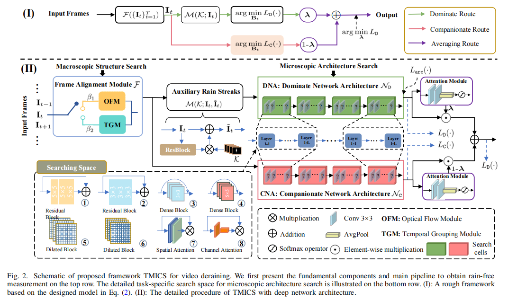
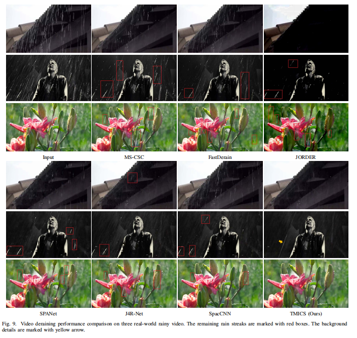

# TMICS
## Triple-level Model-Guided Collaborative Network Architecture for Video Deraining 

[Pan Mu](), [Zhu Liu](), [Yaohua Liu](https://dutmedia.org), [Risheng Liu](https://dutmedia.org), and [Xin Fan](https://dutmedia.org)

[[Paper Link]](tip) [[Project Page]]()

### Abstract

Video deraining is an important issue for outdoor vision systems and has been investigated extensively. However, designing optimal architectures by the aggregating model formation and data distribution is a challenging task for video deraining. In this paper, we develop a model guided triple-level optimization
framework to deduce network architecture with cooperating
optimization and auto-searching mechanism, named Triple-level
Model Inferred Cooperating Searching (TMICS), for dealing with
various video rain circumstances. In particular, to better explore
inter-frame information from videos, we first introduce a macroscopic structure searching scheme that searches from Optical
Flow Module (OFM) and Temporal Grouping Module (TGM) to
help restore the latent frame. In addition, existing methods cannot
preserve details and structure when removing rain streaks.
To overcome the problems, we then design a collaborative
structure for video deraining based on the proposed optimization
model. This structure includes Dominate Network Architecture
(DNA) and Companionate Network Architecture (CNA) and is
cooperated by introducing an Attention-based Averaging Scheme
(AAS). To obtain suitable task-specific architectures (i.e., DNA
and CNA), we apply the differentiable neural architecture search
from a compact candidate set of task-specific operations to discover desirable rain streaks removal architectures automatically.
Extensive experiments on various datasets demonstrate that our
model shows significant improvements in fidelity and temporal
consistency over the state-of-the-art works.

### Framework

## Prerequisites
- Linux or Windows
- Python 3
- NVIDIA GPU + CUDA cuDNN
- PyTorch 1.2

## Detailed configuration

## Results
- Video supplementary material: [Baiduyun(code: o09j)](https://pan.baidu.com/s/1SkGwIID1IYo3h2BHU7hElQ)

## Pretrained Models
 - Models:[Baiduyun(code: 72vy)](https://pan.baidu.com/s/1YRo52SuAi-Lt4uOCYozhbw)

